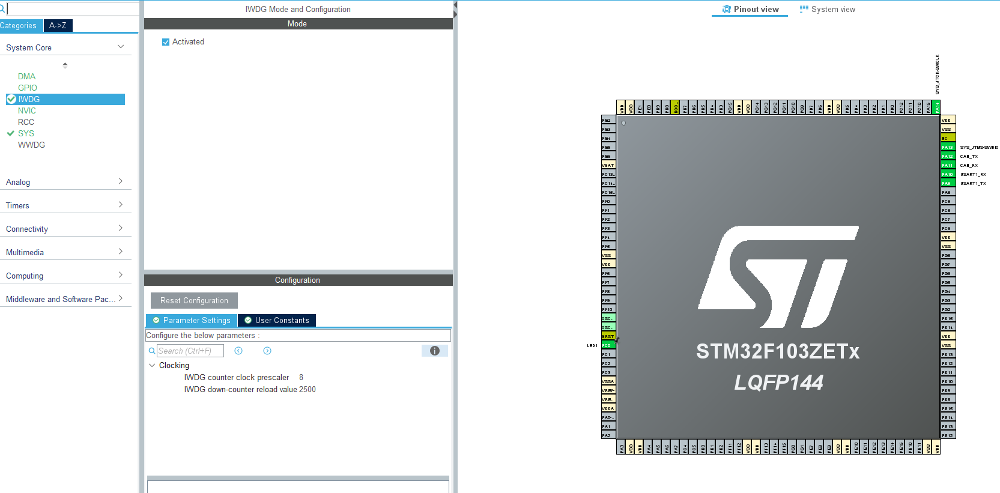

# STM32F103 FBL CAN UDS Implementation Document

This document mainly to record CAN UDS the implementation process  

| Version | Date       | Author | Changes       |
|---------|------------|--------|---------------|
| 1.0     | 2025-08-01 | zhou   | implement IWDG |


## 1. Module Overview

### 1.2 Hardware Requirements
| Component       | Specification        | 
|-----------------|----------------------|
| Microcontroller | STM32F103ZET6, 64MHz |
| Peripheral      |  IWDG (40kHZ)        |
| External Device |                      |
| Power Supply    | 3.3V ±5%             |

### 1.3 Software Requirements
- Development Environment: STM32CubeMX v6.12.1
- RTOS: loop
- HAL Library: 
- Compilation environment : vscode,stm32Cube,CMake


## 2. Design Specifications

### 2.1 Functional Requirements
1. ["Initialize IWDG "]
2. ["It must refresh watch dog in 500ms,if timeout,it will reset"]
3. ["Implement software reset"]


### 2.2 Performance Requirements

### 2.3 State Machine DesignstateDiagram


## 3. Implementation Details

### 3.1 smt32cubmx


### 3.2 Initialization 
```
void MX_IWDG_Init(void)
{

  /* USER CODE BEGIN IWDG_Init 0 */

  /* USER CODE END IWDG_Init 0 */

  /* USER CODE BEGIN IWDG_Init 1 */

  /* USER CODE END IWDG_Init 1 */
  hiwdg.Instance = IWDG;
  hiwdg.Init.Prescaler = IWDG_PRESCALER_8;
  hiwdg.Init.Reload = 2500;
  if (HAL_IWDG_Init(&hiwdg) != HAL_OK)
  {
    Error_Handler();
  }
  /* USER CODE BEGIN IWDG_Init 2 */

  /* USER CODE END IWDG_Init 2 */

}
```
```
void Software_Reset(void)
{

    __HAL_RCC_AFIO_CLK_ENABLE();
    
    NVIC_SystemReset();  // HAL 库封装的复位函数，内部已处理密钥
}

``` 
## 4. API Reference

| Function           | Description             | Parameters                                                             | Return Value |
|--------------------|-------------------------|------------------------------------------------------------------------|--------------|
| `MX_IWDG_Init()`   | Initializes IWDG module |no                                                                      | no           |
| `Software_Reset()` | reset mcu               |no                                                                      | no           |


## 5. Testing and Validation

### 5.1 Test Environment


### 5.2 Test Cases

| Test ID | Test Description | Test Steps | Expected Result | Actual Result | Pass/Fail |
|---------|------------------|------------|-----------------|---------------|-----------|
| TST-001 | init IWDG,no refresh IWDG | 1. MX_IWDG_Init(); <br>2.while(1),no refresh IWDG | it resets  <br>| As expected | Pass |
| TST-002 | init IWDG, refresh IWDG | 1. MX_IWDG_Init(); <br>2.while(1), refresh IWDG every 200ms | it runs normal  <br>| As expected | Pass |
| TST-003 |                        | 1.Software_Reset()  |  it resets   | As expected | Pass |

### 5.3 Performance Test Results

it test pass 

## 8. References

